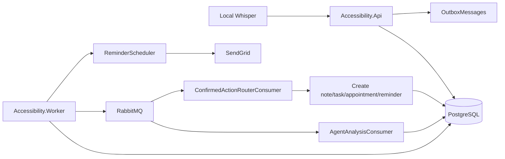

# Accessibility Communication Assistant MVP

Production-style MVP backend for finalized transcript intake, AI analysis, proposed actions, confirmation, reminders, and email delivery.

## Stack

- .NET 8 ASP.NET Core Web API
- EF Core + PostgreSQL
- RabbitMQ + MassTransit
- Worker service for consumers, outbox, reminders
- SendGrid email integration
- xUnit tests
- Docker Compose

## Local Env

Copy `.env.example` to `.env` and fill local secrets. Do not commit `.env`.

Required for JWT:

```text
JWT_SECRET=replace-with-at-least-32-random-characters
JWT_ISSUER=UavPms.Api
JWT_AUDIENCE=UavPms.Client
JWT_EXPIRY_MINUTES=60
```

Optional for real email:

```text
SENDGRID_API_KEY=
SENDGRID_FROM_EMAIL=noreply@example.com
SENDGRID_FROM_NAME=Accessibility Assistant
```

With no AI key, backend uses deterministic fake agent.
For Groq-backed agent behavior, set:

```text
AI_PROVIDER=groq
AI_API_KEY=your-groq-api-key
AI_MODEL=llama-3.3-70b-versatile
```

## Docker

Full stack:

```bash
docker compose up --build
```

Services:

- API: http://localhost:8080
- Swagger: http://localhost:8080/swagger/index.html
- RabbitMQ UI: http://localhost:15672
- PostgreSQL: localhost:5432

Worker applies EF migrations on startup, then runs consumers, outbox processor, and reminder scheduler.

## Test

Local tests require the .NET 8 runtime/SDK installed on the machine running tests.
If the host only has .NET 9/10, run tests through Docker instead.

These may take longer than 45 seconds after target/package changes:

```bash
dotnet restore Accessibility.slnx
dotnet test Accessibility.slnx --no-restore
docker compose build
```

Docker test command:

```bash
docker compose --profile test run --rm tests
```

API smoke test after starting Docker Compose:

```powershell
docker compose down -v
docker compose up -d --build
.\scripts\smoke-test.ps1
```

`docker compose down -v` removes the local PostgreSQL volume. Use it for clean demo validation, not when preserving local data matters.

## Demo Seed

On API startup, demo seed is enabled by default:

```text
DEMO_SEED_ENABLED=true
```

It creates:

- User: `local@example.com`
- Conversation: `22222222-2222-2222-2222-222222222222`
- One transcript that asks the AI agent to plan a note, appointment, and reminder
- One outbox event so the worker/Groq agent processes it automatically

Use this Swagger endpoint to inspect the seeded conversation:

```text
GET /api/conversations/22222222-2222-2222-2222-222222222222/proposed-actions
```

## Example Flow

1. Create conversation.
2. Submit finalized transcript.
3. Outbox publishes `TranscriptReceived`.
4. Worker creates analysis and fake agent proposals.
5. Read proposed actions.
6. Confirm appointment/reminder actions.
7. Outbox publishes confirmation.
8. Worker creates appointment/reminder.
9. Reminder scheduler publishes email work when due.

Example transcript body:

```json
{
  "speaker": "HearingUser",
  "originalText": "Ngay mai luc 8 gio toi co lich kham o benh vien Cho Ray, hay nhac toi truoc 30 phut.",
  "language": "vi",
  "startedAt": "2026-07-11T10:00:00+07:00",
  "endedAt": "2026-07-11T10:00:05+07:00",
  "sequenceNumber": 1
}
```

## Architecture


